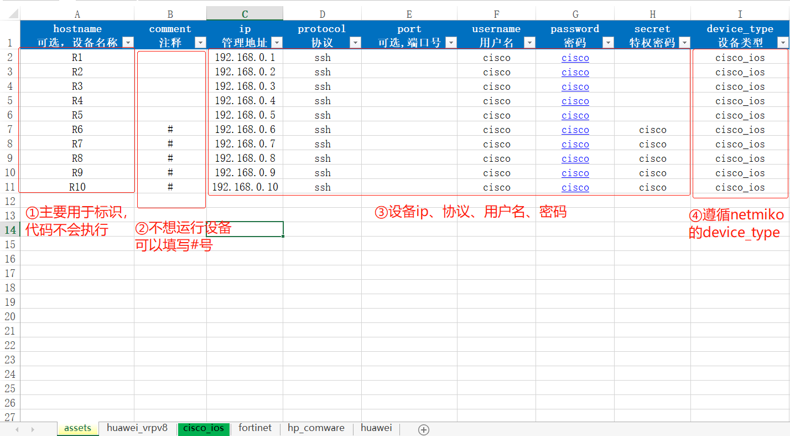
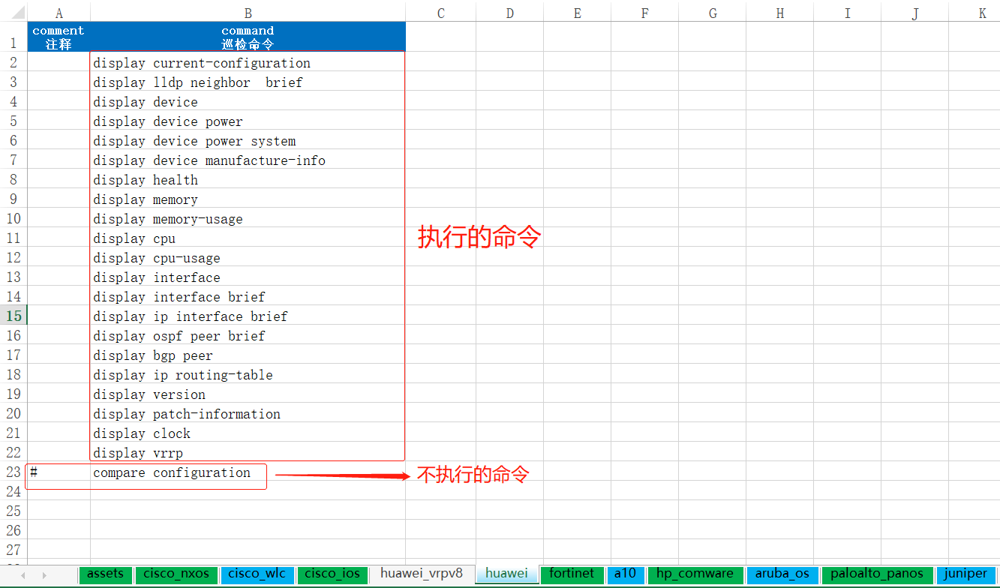

# Network_Automatic_Inspect 网络自动化巡检工具
> 适用于网络工程师自动化采集设备信息、下发配置、保存设备配置及批量ping等功能.

---

# 1.如何设计与开发
## 1.1 B站视频讲解

[1# 网络自动化巡检工具-开篇](https://www.bilibili.com/video/BV1GY411g7e6/)

[2# 网络自动化巡检工具(2)-读取excel基本信息](https://www.bilibili.com/video/BV1G94y1m7XL/)

[3# 网络自动化巡检工具(3)-连接网络设备及执行命令](https://www.bilibili.com/video/BV1V94y1m7wX/)

[4# 网络自动化巡检工具(4)-连接测试及采集写入文件](https://www.bilibili.com/video/BV1VS4y1i7ru/)

[5# 网络自动化巡检工具(5)-如何重写Netmiko中的类](https://www.bilibili.com/video/BV11W4y1k7QW/)

[6# 网络自动化巡检工具(6)-格式化输出](https://www.bilibili.com/video/BV1s94y1R7KE/)

_说明：代码会不间断的迭代更新，请下载最新版本._

---

# 2.有哪些自动化的功能

## 2.1 有哪些功能
> 不定期增加新功能.

 - [x] 实现批量 **采集网络设备配置** 

 - [ ] 实现批量 **下发设备配置**(待完善)

 - [ ] 实现批量 **保存设备配置**(待完善)
 
 - [ ] 实现批量 **Ping IP地址**(待完善)

 - [ ] 实现批量 **nmap公网IP业务端口**(待完善)

 - [ ] 实现生成 **网络巡检报告**(待开发)


---

# 3.如何使用
## 3.1 环境准备
- 安装好python环境，推荐版本`python ≥3.9`
- 安装必要的第三方模块

    按照如下命令进行安装：
    
    `pip install -r requirement.txt`
    ```python
    # 文件主要包括如下必要模块.
    netmiko==3.4.0
    prettytable==3.3.0
    openpyxl==3.0.9
    ```

## 3.2 巡检模板说明
打开`巡检模板.xlsx`, 主要分2个sheet：
- 网络设备资产表（assets） 


**字段说明：**
1. hostname: **可选项**，设备名称，仅标识作用,代码不会执行该字段.
2. comment:  **可选项**, 注释，可用于执行设备巡检或不巡检.
3. ip: **<font color='red'>必填项</font>，**管理IP地址，.
4. protocl: **<font color='red'>必填项</font>**，连接协议，支持ssh和telnet.
5. port：**可选项**，协议端口号，支持自定义端口(自定义为必填)。
6. username：**可选项**，设备登陆用户名，.
7. password：**可选项**，设备登陆密码，.
8. secret：**可选项**，特权/超级密码，.
9. device_type：**<font color='red'>必填项</font>**，设备类型，.


- 巡检命令表


**字段说明：**
1. comment:  **可选项**, 注释，可用于执行或不执行的命令.
2. command：**<font color='red'>必填项</font>，巡检的命令


# 3，开始你的使用
可通过pycharm、vscode或python IDE等工具执行脚本文件，如下所示：

**选项说明：**
1. 连接设备：执行后仅用于获取到设备名称，测试连接性。

   _示例：<cisco-router-01>,表示已经可以登陆到设备_
2. 采集设备信息：通过执行`show`等命令采集回显内容。

   _示例：show running，采集`runing`配置_

# 4.分享平台
## 4.1 微信公众号、知乎、B站
> 欢迎关注, 点滴技术.

## 4.2 微信交流群


_说明：扫码加群主微信号，备注点滴技术，然后邀请进交流群。_


# 5. 打赏
> **如果您觉得工具好用的话，可以请我喝杯咖啡的。**
> 
